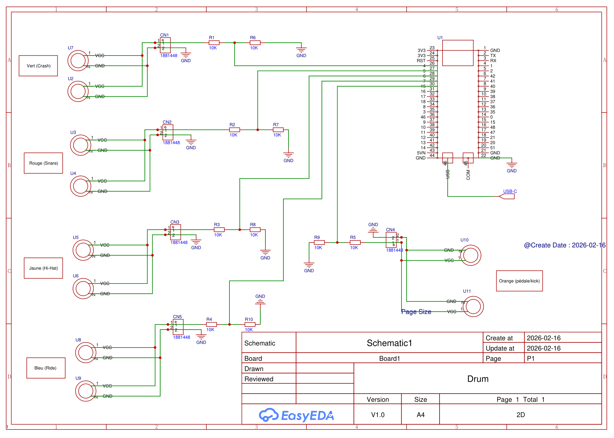

# ESP32-S3-Drum-Kit

This is a drum kit using the ESP32-S3 microcontroller, it utilizes the MIDI protocol to communicate with a computer or other MIDI-compatible devices. The drum kit consists of several pads that can be hit to produce different drum sounds.

# Schematic

# How to Use
1. Build the drum kit according to the schematic provided above.
2. Connect the ESP32-S3 to your computer using a USB cable.
3. Flash the code to the ESP32-S3 using the Arduino IDE or PlatformIO.
4. Open a MIDI-compatible software on your computer (e.g. Clonehero)
5. Hit the pads, and you should see the corresponding notes being sent to the MIDI software.

# Context

This is my (@dylanbrass) first project with the Arduino framework and my first "big" C++ project. 
@hdog412 already a working prototype of the drum kit, but needed help with the code and the MIDI communication, so we decided to work together on this project.

## Background
I am a Software Engineering student and @hdog412 is a Mechanical Engineering student, we wanted to play drums in CloneHero so we decided to build our own drum kit using the ESP32-S3 microcontroller.
